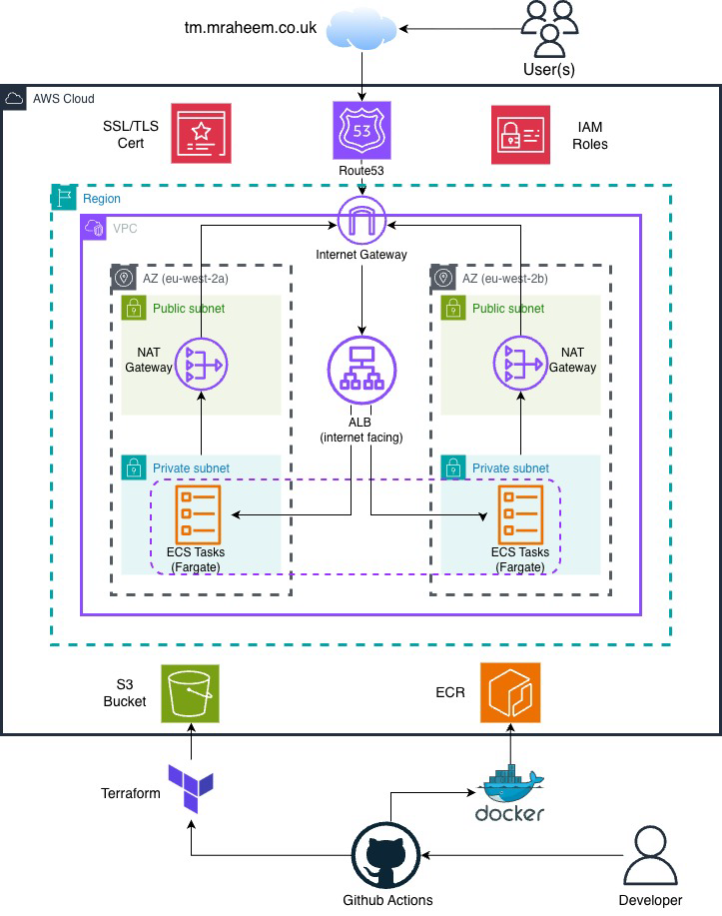
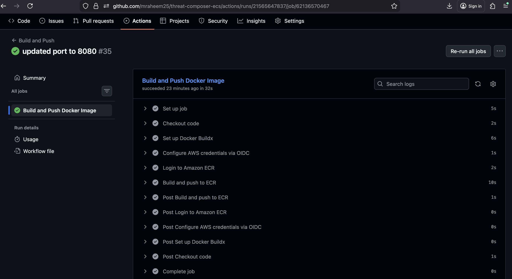
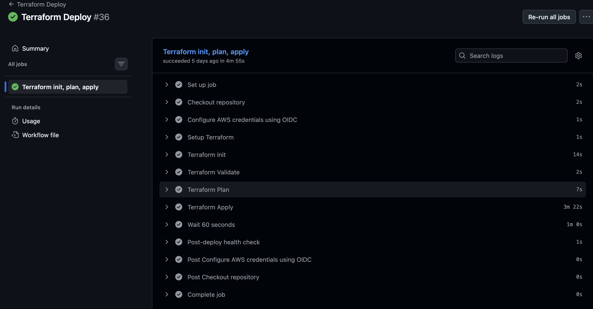
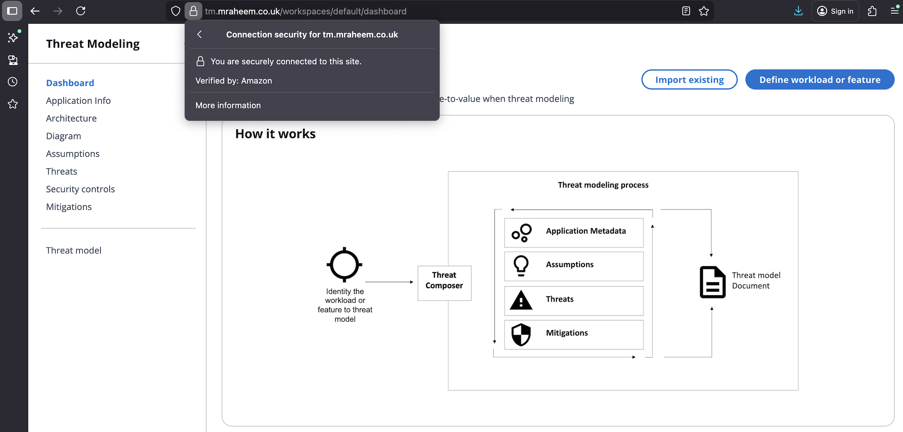

# ECS Threat Composer Deployment

<!-- Project badges -->


This project is a deployment of a containerised web application (AWS Threat Composer). It focuses on comtainerising the app using Docker; building the infrastructure in Terraform and automating deployments using GitHub Actions. The result is a live, production style setup deployed to AWS, which is accessible via a custom domain over HTTPS.

## Project Structure
```text
./
├── .github/
│   └── workflows/
│       ├── build-push.yaml
│       └── deploy.yaml      
│       
├── app/
├── infra/
│   ├── main.tf
│   ├── provider.tf
│   ├── variables.tf
│   └── modules/
│       ├── acm/
│       ├── alb/
│       ├── ecr/
│       ├── ecs/
│       ├── iam/
│       └── vpc/
└── Dockerfile
```

## Architecture



Key components:
-	VPC with public and private subnets across 2 availability zones (AZs)
-	NAT Gateway in 2 AZ's providing outbound internet access from private subnets
-	Application Load Balancer (ALB) in public subnets to distribute imcoming traffic
-	ECS Fargate service running tasks in private subnets
-	ACM certificate for HTTPS
-	Route 53 + Cloudflare for DNS
-	Terraform state backend (S3 for state storage)
-	GitHub Actions for CI/CD using OIDC

## Overview

The project followed a staged procedure, moving from local validation to automated deployment.

### Prerequisites
- AWS account
- Terraform
- Docker
- GitHub repository
- Domain managed via Route 53 and/or Cloudflare

## Application and Local Validation

I first had to clone the existing Threat Composer application repository.

- Local set up:
```bash
yarn install
yarn build
yarn global add serve
serve -s build
```

Then in your browser run:
```text
http://localhost:3000
```
- Local Health Check:
After the local setup you can run a health check:
```bash
curl -f http://localhost:3000/health.json
```

## Terraform (Infrastructure)
Terraform provisions the AWS infrastructure in `infra/` using a modular setup.

#### Request flow
1. User enters `tm.mraheem.co.uk` into the browser.
2. Route 53 resolves the domain and returns the ALB DNS name.
3. If the request is HTTP, the ALB redirects it to HTTPS.
4. For HTTPS, the ALB performs the TLS handshake using the ACM certificate then forwards the request to the target group, which has the task IPs.
5. ECS manages tasks running in private subnets. Container receives traffic on port 8080 and logs are sent to CloudWatch.

#### Networking
- Creates a VPC with 2 Availability Zones (AZ). Each AZ has its own public and private subnet
- NATGW's are situated in public subnets providing the private subents with outbound access. Public subnets route to an Internet Gateway.

#### Load Balancing and DNS
- Creates an internet facing ALB with:
  - HTTP listener that redirects to HTTPS
  - HTTPS listener that forwards to the target group
- Creates a Route 53 alias A record pointing the subdomain to the ALB.

#### SSL/TLS (HTTPS)
- Requests an ACM certificate using DNS validation.
- Creates the validation records in Route 53 and completes certificate validation.

#### ECS
- Creates an ECS cluster.
- Creates the task definition.
- Creates an ECS service that manages tasks in private subnets.
- Tasks only accept inbound traffic from the ALB on port 8080.

#### IAM
- Creates the ECS task execution role used by tasks at runtime.

#### ECR
- Reads an existing ECR repository for the deployment

## CI/CD Workflows (GitHub Actions)

All workflows run from this repo using GitHub Actions and authenticate to AWS using GitHub OIDC. Terraform workflows run from the `infra/` directory and require manual confirmation.

### Push to ECR workflow:
- Trigger: push to `main` when `app/` or `Dockerfile` changes or manual run with confirmation.
- Action: build Docker image and push to ECR.
- Tags: latest and the github SHA.



### Terraform Deploy workflow:
- Trigger: manual run with confirmation.
- Action: `terraform apply -auto-approve`.
- Verify: wait 60s then `curl -f https://tm.mrahaeem.co.uk/health.json` to run a health check.



--- 

## Live Domain Page



---

## Challenges and lessons learnt
Throughout this project, I faced several challenges, which helped me furthen my understanding. I also recognised the importance of commiting often and early to make safe, iterative changes and ease debugging. Some of the challenges included:
- Application not being accessible to the internet and the traffic not reaching the ALB.
- As a Mac user, I was implementing ARM 64 when I built the infrastructure via terraform. This resulted in very long build times when it came to building my pipelines.

